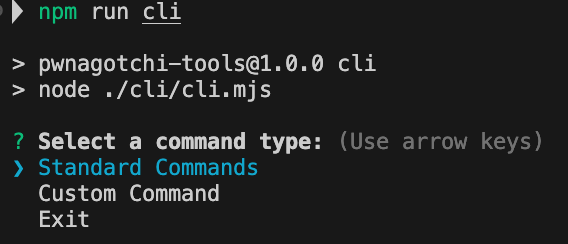
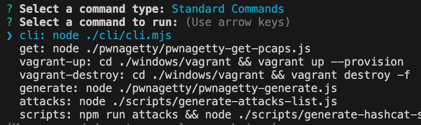
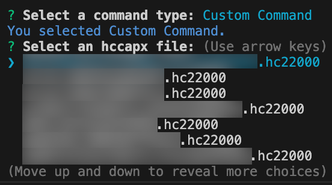
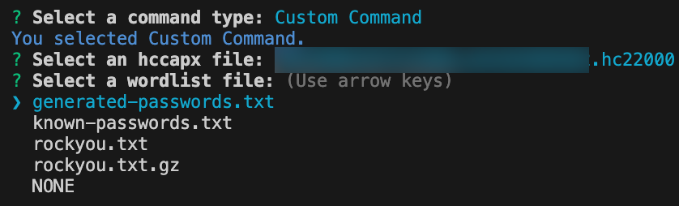
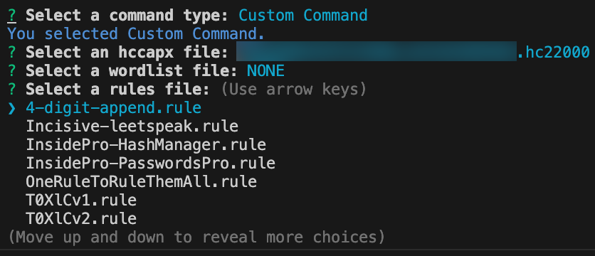
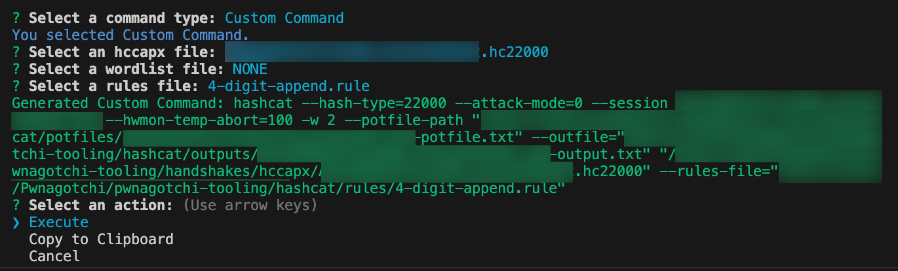
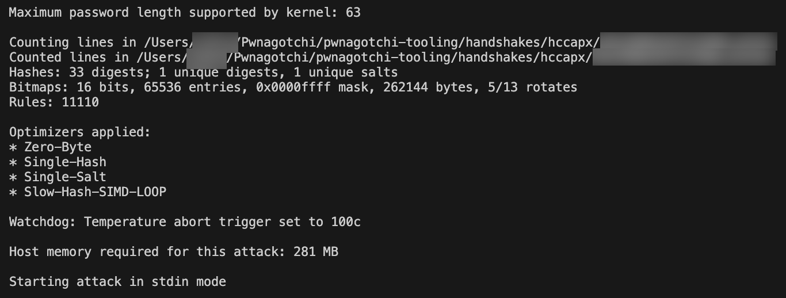
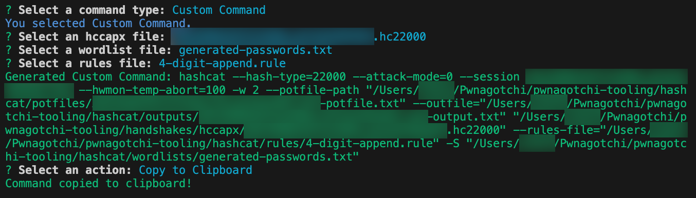

# Pwnscription
```
██████╗ ██╗    ██╗███╗   ██╗███████╗ ██████╗██████╗ ██╗██████╗ ████████╗██╗ ██████╗ ███╗   ██╗
██╔══██╗██║    ██║████╗  ██║██╔════╝██╔════╝██╔══██╗██║██╔══██╗╚══██╔══╝██║██╔═══██╗████╗  ██║
██████╔╝██║ █╗ ██║██╔██╗ ██║███████╗██║     ██████╔╝██║██████╔╝   ██║   ██║██║   ██║██╔██╗ ██║
██╔═══╝ ██║███╗██║██║╚██╗██║╚════██║██║     ██╔══██╗██║██╔═══╝    ██║   ██║██║   ██║██║╚██╗██║
██║     ╚███╔███╔╝██║ ╚████║███████║╚██████╗██║  ██║██║██║        ██║   ██║╚██████╔╝██║ ╚████║
╚═╝      ╚══╝╚══╝ ╚═╝  ╚═══╝╚══════╝ ╚═════╝╚═╝  ╚═╝╚═╝╚═╝        ╚═╝   ╚═╝ ╚═════╝ ╚═╝  ╚═══╝
```

# DISCLAIMER
## This project is for WiFi security education purposes ONLY!
## Hacking WiFi networks that you DO NOT OWN IS ILLEGAL!

----

# Purpose
I created this project to make the process of cracking Wi-Fi handshakes gathered by a `Pwnagotchi` using the `Hashcat` tooling, on both OS X and Windows, easier by generating the necessary terminal commands for you. I developed a CLI (`npm run cli`) utility that allows you to quickly build and execute `hashcat` commands from the terminal.


In order to create the project I started by combining and refactoring different repos that were no longer maintained.
* [Pwnagotchi-Tools](https://github.com/mtagius/pwnagotchi-tools): [mtagius](https://github.com/mtagius)
* [Pwnagetty](https://github.com/CyrisXD/Pwnagetty): [CyrisXD](https://github.com/CyrisXD)
* [Weakpass](https://github.com/zzzteph/weakpass): [zzzteph](https://github.com/zzzteph)

## Included Tooling
* `npm run get`: OS X - Download the `.pcap` files from your `Pwnagotchi`.
	* `npm run vagrant-up`: Windows - Download the `.pcap` files from your `Pwnagotchi`.
	* `npm run vagrant-destroy`: Windows - Delete the Vagrant image when you are done.
* `npm run generate`: Generate the `.hc22000` and `.pmkid` files for `hashcat` to crack based on the `.pcap` files you download.
* `npm run cli`: Run the availabe `npm run` commands as well as building `hashcat` scripts quickly.
* `npm run passwords`: Generate a custom wordlist containing all combinations of the `WORD_LIST` in the `config.js` file.
* `npm run combos`: Generate the results of what happens when a `.rule` file is applied to a wordlist file for a better understanding of what `.rule` files do in `hashcat`.
* `npm run results`: Displays a list of cracked networks in the terminal.

# Table Of Contents
* [Dependencies](#dependencies)
	* [OS X](#os-x-dependencies)
	* [Windows](#windows-dependencies)
* [Pwnagotchi Setup](#pwnagotchi-setup)
	* [Images/Config Files](#imagesconfig-files)
	* [Setup](#setup)
* [Installation](#installation)
	* [OS X](#os-x-installation)
	* [Windows](#windows-installation)
* [Initial Configuration](#initial-configuration)
	* [OS X](#os-x-configuration)
	* [Windows](#windows-configuration)
* [Additional Configuration Steps](#additional-configuration-steps)
	* [Wordlists](#wordlists)
		* [Known Password Wordlist](#known-password-wordlist)
		* [Custom Wordlists](#custom-wordlists)
		* [Standalone Wordlists](#standalone-wordlists)
		* [Standalone Dictionaries](#standalone-dictionaries)
		* [Misc Wordlists](#misc-wordlists)
	* [Unzip rockyou.txt.gz](#unzip-rockyoutxtgz)
		* [OS X](#unzip-os-x)
		* [Windows](#unzip-windows)
	* [Rules](#rules)
		* [Included Rules](#included-rules)
		* [Rule Combinations Generation](#rule-combinations-generation)
	* [Masks](#masks)
		* [Included Masks](#included-masks)
* [Scripts](#scripts)
	* [Copy the .PCAP files to your machine.](#copy-the-pcap-files-to-your-machine)
	* [Generate the .HC22000/.PMKID files.](#generate-the-hc22000pmkid-files)
		* [OS X](#os-x---generate)
		* [Windows](#windows---generate)
	* [CLI](#cli)
		* [Command Breakdown](#command-breakdown)
		* [Attack Command Examples](#attack-command-examples)
			* [--attack-mode=0](#attack-mode0)
			* [--attack-mode=3](#attack-mode3)
			* [--attack-mode=6](#attack-mode6)
			* [--attack-mode=9](#attack-mode9)
		* [Example Terminal Output](#example-terminal-output)
	* [Password Generator](#custom-wordlists)
	* [(.rule * .txt) Results](#rule-combinations-generation)
	* [Cracked Network Results](#cracked-networks-results)
* [Troubleshooting](#troubleshooting)
* [Links](#links)
* [To-Do](#to-do)

# Dependencies
## OS X Dependencies
* [Brew](https://docs.brew.sh/Installation)
* [NodeJS](https://nodejs.org/en/download)
* [hcxpcapngtool](https://github.com/warecrer/Hcxpcaptool)
* [Hashcat](https://manpages.org/hashcat)

## Windows Dependencies
* [NodeJS](https://nodejs.org/en/download)
* [Vagrant](https://developer.hashicorp.com/vagrant/install)
* [Virtual Box](https://www.virtualbox.org/wiki/Downloads)
	* Vagrant and Virtual Box are only used to convert `.pcap` files to the corresponding `.hccapx`/`.pmkid` files.
* [Hashcat v6.2.6 binaries](https://hashcat.net/hashcat/)
	* Make note of the `PATH` to where you unpacked `Hashcat`.
		* Example: `C:\\[PATH]\\hashcat-6.2.6`

# Pwnagotchi Setup
## Images/Config Files
I've included a number of `default.toml` files for the different `Pwnagotchi` images you can find as I found them helpful when configuring my `Pwnagotchi`.
I've also included a `minimal-config.toml` file with the bare minimal configuration settings to get a `Pwnagotchi` up and running.

| Repo														 | Default   																									 | Local   								     |
|------------------------------------------------------------|---------------------------------------------------------------------------------------------------------------|-------------------------------------------|
| [Original](https://github.com/evilsocket/pwnagotchi/)      | [default.toml](https://github.com/evilsocket/pwnagotchi/blob/master/pwnagotchi/defaults.toml)    			 | `./pwnagotchi/defaults-original.toml`     |
| [Torch](https://github.com/jayofelony/pwnagotchi-torch)    | [default.toml](https://github.com/jayofelony/pwnagotchi-torch/blob/pwnagotchi-torch/pwnagotchi/defaults.toml) | `./pwnagotchi/defaults-torch.toml`        |
| [Aluminum-Ice](https://github.com/aluminum-ice/pwnagotchi) | [default.toml](https://github.com/aluminum-ice/pwnagotchi/blob/master/pwnagotchi/defaults.toml)    			 | `./pwnagotchi/defaults-aluminum-ice.toml` |

## Setup
* Official
	* [Connecting to your Pwnagotchi: pwnagotchi.ai](https://pwnagotchi.ai/configuration/#connect-to-your-pwnagotchi)

# Installation
## OS X Installation
* `git clone https://github.com/ivy00johns/pwnagotchi-tools/`
* `npm install`
* `brew install hcxpcaptool`
* `brew install hashcat`

## Windows Installation
* `git clone https://github.com/ivy00johns/pwnagotchi-tools/`
* `npm install`

# Initial Configuration
## OS X Configuration
1. `cp .config.example .config`
2. Set the details for your `Pwnagotchi`:
	```javascript
	...
	// Pwnagotchi SSH configuration
	PWNAGOTCHI_SSH: {
		HOST_ADDRESS: "", // Pwnagotchi SSH host address
		USERNAME: "", // Pwnagotchi SSH username
		PASSWORD: "", // Pwnagotchi SSH password
		PORT: 22 // Pwnagotchi SSH port
	},

	// Windows configuration
	WINDOWS: false, // Flag to indicate if running on Windows
	HASHCAT_PATH: "", // Path to Hashcat file on Windows
	...
	```

## Windows Configuration
1. `cp .config.example .config`
2. Set the details for your `Pwnagotchi`:
	```javascript
	...
	// Pwnagotchi SSH configuration
	PWNAGOTCHI_SSH: {
		HOST_ADDRESS: "", // Pwnagotchi SSH host address
		USERNAME: "", // Pwnagotchi SSH username
		PASSWORD: "", // Pwnagotchi SSH password
		PORT: 22 // Pwnagotchi SSH port
	},

	// Windows configuration
	WINDOWS: true, // Flag to indicate if running on Windows
	HASHCAT_PATH: "C:\\[PATH]\\hashcat-6.2.6", // Path to Hashcat file on Windows
	...
	```

# Additional Configuration Steps
## Wordlists
By default this repo contains a single popular large wordlist, `./hashcat/wordlists/rockyou.txt.gz` (`~54 MB`), that you will need to unzip (`~140 MB`). You will want to download additional ones to work with as well. You can place any new wordlists in the provided `./hashcat/wordlists` directory, or reference the directory path in the `.config.js` file.
```javascript
...
WORDLISTS: [
	"./hashcat/wordlists",
],
...
```

```javascript
...
WORDLISTS: [
	"./hashcat/wordlists/rockyou.txt",
],
...
```

### Unzip rockyou.txt.gz
#### Unzip OS X
1. `gzip ./hashcat/wordlists/rockyou.txt.gz --keep`

#### Unzip Windows
1. `tar -zxvf .\hashcat\wordlists\rockyou.txt.gz`

### Known Password Wordlist
* You can add your own known or suspected passwords by cloning the example wordlist and/or dictionary file and editing it.
	1. `cp ./hashcat/known-passwords.example.txt ./hashcat/wordlists/known-passwords.txt`
	2. `cp ./hashcat/known-passwords.example.dic ./hashcat/wordlists/known-passwords.dic`

### Custom Wordlists
You can generate a list of possible passwords based on a couple of clues that could have be used to build the password you want to crack.

```javascript
...
// General configurations
PRINT_ITEMS: 10, // Number of items to print in the terminal
GENERATE_PERMUTATIONS: 2000, // Number of permutations to generate and add to the .txt file
EXPORT_FILE_NAME: "./hashcat/wordlists/generated-passwords.txt", // Name of the exported file
WORD_LIST: [], // List of words for generation
MAX_WORDS_USED: 2, // Max number of words that can be combined to form a given string
...
```

1. Edit the `config.js` file and add your clues to the `WORD_LIST: []` array.
	- `WORD_LIST: [A, B, C, D, E]`
2. Set the `MAX_WORDS_USED` variable to configure how many words will be contained in the final results:
	* 1 => `[A, B, C, D, E]` - 5 results
	* 2 => `[A, B, C, D, E, AB, AC, AD, AE, BA, BC, BD, BE, CA, CB, CD, CE, DA, DB, DC, DE, EA, EB, EC, ED]` - 25 results
	* Etc...
3. Run the `npm run passwords` command to generate a list of possible password combinations.
	* `["A", "AB", "AC", "AD", "AE", "B", "BA", "BC", "BD", "BE", "C", "CA", "CB", "CD", "CE", "D", "DA", "DB", "DC", "DE", "E", "EA", "EB", "EC", "ED"]`
4. It will export the list to a `.txt` file at the specificed location, `EXPORT_FILE_NAME`, by default:
	* `./hashcat/wordlists/generated-passwords.txt`
5. For example say you set the `WORD_LIST:` to `["cat", "dog", "rat"]`, you would get the following results:
	```text
	cat
	catdog
	catrat
	dog
	dogcat
	dograt
	rat
	ratcat
	ratdog
	```
6. You can then use the `generated-passwords.txt` file to try and crack the network passowrd by running `npm run scripts` again and looking for the wordlist in the generated script file for a given network.

### Standalone Wordlists
* [netgear-spectrum.txt](https://raw.githubusercontent.com/soxrok2212/PSKracker/master/dicts/netgear-spectrum/netgear-spectrum.txt)
	* Part of the much larger colleciton [PSKracker](https://github.com/soxrok2212/PSKracker) by [soxrok2212](https://github.com/soxrok2212/).

* [openwall.net-all.txt](https://raw.githubusercontent.com/danielmiessler/SecLists/master/Passwords/openwall.net-all.txt)
	* Part of the [DanielMiessler's SecLists](https://github.com/danielmiessler/SecLists/) larger collection of [passwords](https://github.com/danielmiessler/SecLists/tree/master/Passwords).

* [shortKrak.txt](https://raw.githubusercontent.com/praetorian-inc/Hob0Rules/master/wordlists/shortKrak.txt)
	* Part of the [praetorian-inc/Hob0Rules](https://github.com/praetorian-inc/Hob0Rules/) collection of [wordlists](https://github.com/praetorian-inc/Hob0Rules/tree/master/wordlists).

* [nerdlist.txt](https://raw.githubusercontent.com/TheNerdlist/nerdlist/main/nerdlist.txt)

* [English Words](https://raw.githubusercontent.com/dwyl/english-words/master/words_alpha.txt)

### Standalone Dictionaries
* [Outpost9 Dictionary](https://www.outpost9.com/files/wordlists/)
	* [Names](https://www.outpost9.com/files/wordlists/names.zip)

### Massive Wordlists
* [Weakpass Wordlists](https://weakpass.com/wordlist/)
	* [Custom-WPA](https://weakpass.com/wordlist/490)
	* [Super-WPA](https://weakpass.com/wordlist/500)
	* [hashesorg2019](https://weakpass.com/wordlist/1851)

### Misc Wordlists
* [Original Forked Repo Wordlists](https://github.com/praetorian-inc/Hob0Rules/tree/master/wordlists)

## Rules
[Hashcat Rules](https://hashcat.net/wiki/doku.php?id=rule_based_attack)

<pre>
Hashcat rules are a powerful tool for generating password candidates based on patterns and rules. They can be used to crack passwords that follow specific patterns, such as those that use common words, numbers, or symbols. Hashcat rules can also be used to generate passwords that are more complex and less likely to be guessed.

Here is a brief explanation of some of the basic Hashcat rules:

Case modification rules: These rules change the capitalization of letters in a word. For example, the l rule converts all letters to lowercase, the u rule converts all letters to uppercase, and the c rule capitalizes the first letter of each word.

String manipulation rules: These rules add, remove, or modify characters in a word. For example, the $N rule appends a character to the end of each word, the ^N rule prefixes a character to the start of each word, and the d rule duplicates each word in the wordlist.

Reversal rules: These rules reverse the order of letters in a word. For example, the r rule reverses each word in the wordlist.

Conditional rules: These rules control which password candidates are generated. For example, the ?N rule skips passwords that do not contain a specific character, and the !N rule skips passwords that contain a specific character.

Hashcat rules can be combined in a variety of ways to create complex password-generation patterns. For example, the following rule generates passwords that are at least six characters long and start with a lowercase letter:

?l?l?l?l?l?l

This rule will skip any passwords that are less than six characters long or do not start with a lowercase letter. It will then generate all possible combinations of lowercase letters, numbers, and symbols to create passwords that meet these criteria.

Hashcat rules are a powerful tool for cracking passwords, but they are also a valuable asset for security researchers. By understanding how Hashcat rules work, security researchers can develop better defenses against password-based attacks.
</pre>

#### Here are some additional resources for learning more about Hashcat rules:	
* Hashcat rule-based attack: https://en.wikipedia.org/wiki/Hashcat
	* Explanation of Hashcat Rules: https://hashcat.net/wiki/doku.php?id=rule_based_attack
	* An Explanation of Hashcat Rules: https://raw.githubusercontent.com/hashcat/team-hashcat/main/CMIYC2021/CMIYC2021TeamHashcatWriteup.pdf
	* Hashcat explained: How this password cracker works: https://www.youtube.com/watch?v=OPTJei6cnw4

### Included Rules
* [NSAKEY.v2.dive](https://github.com/NSAKEY/nsa-rules/blob/master/_NSAKEY.v2.dive.rule) - 83,203 variations per word.
* [4-digit-append]() - 11,110 variations per word.
* [best64](https://trustedsec.com/blog/better-hacking-through-cracking-know-your-rules) - 53 variations per word.
* [bssid]() - ? variations per word.
* [clem9669_medium](https://github.com/clem9669/hashcat-rule) - 160,362 variations per word.
* [d3ad0ne](https://github.com/hashcat/hashcat/blob/master/rules/d3ad0ne.rule) - 12,513 variations per word.
* [d3adhob0](https://github.com/praetorian-inc/Hob0Rules/blob/master/d3adhob0.rule) - 57,489 variations per word.
* [dive](https://github.com/hashcat/hashcat/blob/master/rules/dive.rule) - 35,090 variations per word.
* [generated2](https://github.com/hashcat/hashcat/blob/master/rules/generated2.rule) - 22,499 variations per word.
* [hob064](https://github.com/praetorian-inc/Hob0Rules) - 56 variations per word.
* [Incisive-leetspeak]() - ? variations per word.
* [InsidePro-PasswordsPro](https://github.com/hashcat/hashcat/blob/master/rules/InsidePro-PasswordsPro.rule) - 3,556 variations per word.
* [InsidePro-HashManager](https://github.com/hashcat/hashcat/blob/master/rules/InsidePro-HashManager.rule) - 2,484 variations per word.
* [names]() - 85 variations per word.
* [OneRuleToRuleThemAll]() - 35,474 variations per word.
* [passphrase-rule1]() - ? variations per word.
* [passphrase-rule2]() - 75? variations per word.
* [passphrases]() - ? variations per word.
* [quick--sid]() - 54 variations per word.
* [rockyou-30000](https://github.com/hashcat/hashcat/blob/master/rules/rockyou-30000.rule) - 20,777 variations per word.
* [ssid-ninja]() - 42 variations per word.
* [ssid]() - 82 variations per word.
* [T0XICv1](https://github.com/samirettali/password-cracking-rules/blob/master/T0XlCv1.rule) - 9,537 variations per word.
* [T0XICv2](https://github.com/hashcat/hashcat/blob/master/rules/T0XlCv2.rule) - 15,334 variations per word.
* [toggles5](https://github.com/hashcat/hashcat/blob/master/rules/toggles5.rule) - ? variations per word.
* [unix-ninja-leetspeak](https://github.com/hashcat/hashcat/blob/master/rules/unix-ninja-leetspeak.rule) - ? variations per word.
* [wifi]() - 59 variations per word.

### Rule Combinations Generation 
Are you interested in what a `.rule` file generates? I've include the logic to help answer this questions.

* In the `config.js` file there are a few variables to help with this process. In them you can point to specific `.rule` and `.txt` files to create a list of the results when they are combined. By default it uses the `base-word.txt` file that contains the word `password`, and points to the `base64` rule set.
	```javascript
	...
	// Rule list permutations configurations
	TEST_WORD_LIST: "./hashcat/generator/base-word.txt",
	TEST_RULES_FILE: "./hashcat/rules/_NSAKEY.v2.dive.rule",
	RESULTS_DIRECTORY: "./hashcat/generator/results",
  	GENERIC_RESULTS_FILENAME: "wordlist-plus-rule-combinations.txt"
	...
	```

1. Run the `npm run combos` command to generate the list of strings that `hashcat` will generate in its work.
2. With the default configuration you will get the following results, truncated for readability.
	```text
	password
	sswordpasswordpa
	swordpas
	wordpass
	ordpassw
	rdpasswo
	passwore
	passwora
	dpasswor
	sswordpa
	```
3. By default the results each of the provided `.rule` files applied to the word `password` is provided in the `./hashcat/generator/results` directory.

**PLEASE NOTE**: There are certain rules in some `.rule` files that are not currently implemented in the `wordlist-combinations-generator.js` logic so the `x variations` counts can be lower than expected.

## Masks
<pre>
Masks are used for brute-forcing attacks by defining the characters and their positions in the password. A mask consists of placeholders for characters, where each placeholder represents a specific character set. The possible character sets include:

?l: Lowercase letters (a-z)
?u: Uppercase letters (A-Z)
?d: Digits (0-9)
?s: Special characters
?a: Lowercase letters, uppercase letters, and digits
?b: Custom characters (you define them)
Here's an example mask: ?l?l?l?d?d?s. In this mask:

The first three characters represent lowercase letters.
The next two characters represent digits.
The last character represents a special character.
Now, let's calculate the number of combinations. For each placeholder in the mask, the number of possibilities is the size of the character set it represents.

Lowercase letters (?l): 26 possibilities
Digits (?d): 10 possibilities
Special characters (?s): It depends on the specific character set used (e.g., 32 for default special characters)
So, for the example mask ?l?l?l?d?d?s:

26 × 26 × 26 × 10 × 10 × 32 = 449, 945, 920

This is the total number of combinations that hashcat will attempt for this specific mask. Keep in mind that the actual time it takes to crack a password depends on factors such as the hashing algorithm, hardware performance, and the complexity of the password.
</pre>

### Included Masks
This repo contains the standard `masks` included in the `hashcat` [repository](https://github.com/hashcat/hashcat/tree/master/masks).
* `8char-1l-1u-1d-1s-compliant.hcmask`
* `8char-1l-1u-1d-1s-noncompliant.hcmask`
* `hashcat-default.hcmask`
* `rockyou-1-60.hcmask`
* `rockyou-2-1800.hcmask`
* `rockyou-3-3600.hcmask`
* `rockyou-4-43200.hcmask`
* `rockyou-5-86400.hcmask`
* `rockyou-6-864000.hcmask`
* `rockyou-7-2592000.hcmask`

----

# Scripts
## Copy the .PCAP files to your machine.
To copy the `.pcap` files from your `Pwnagotchi` run the following script.
It will copy the files from the `/root/handshakes` directory on the `Pwnagotchi` to one that you can access from your machine, `/usr/[USERNAME]/handshakes`.
Then it will copy the `/usr/[USERNAME]/handshakes` directory to your machine, in the `./handshakes/pcap` directory.
* `npm run get`

## Generate the .HC22000/.PMKID files.
To generate the necessary `.hc22000`/`.pmkid` files needed to crack the WiFi handshakes run the following script.
### OS X - Generate
* `npm run generate`

### Windows - Generate
* `npm run vagrant-up`

#### Issue
* When you run the `npm run generate` command you will see the following message that I am trying to resolve. It says it found no files when it did indeed generate the files.
	```bash
	Skipping: .gitkeep
	.gitkeep successfully skipped.

	Processing: EXAMPLE_c8d71922525c.pcap
	No PMKID or HCCAPX found.

	Processing: EXAMPLE_3c7a8a78adb8.pcap
	No PMKID or HCCAPX found.

	Processing: EXAMPLE_a41162403502.pcap
	No PMKID or HCCAPX found.
	```

## CLI
Are you looking to build and execute `hashcat` commands quickly based on the files you've already generated? Well you are in luck, I have added `cli` tooling to do just that. 

1. Run `npm run cli` to get started.

2. If you select `Standard Commands` you can execute one of the `npm run` commands listed in the `package.json` file.
	1. Then select the command that you would like to execute.
	* 
3. If you select `Custom Command` you can build a custom command based on existing files.
	1. Select a `.hc22000` file that you would like to crack.
	* 
	2. Select a wordlist you'd like to use, you can also select "`NONE`" as an option.
	*
	3. Select a rule you'd like to use, you can also select "`NONE`" as an option.
	* 
4. Then you  can choose to either `Execute` the command or `Copy to Clipboard`.
* 
* 
* 

### Command Breakdown
* `hashcat` - "Hashcat is the world’s fastest CPU-based password recovery tool."
* `--hash-type=22000` - Hash type: `WPA2-PSK`
* `--attack-mode=0` - Attack mode: `Straight`
* `--session "[HC22000_FILE_NAME]_[RANDOM-NUMBER]"` - Specify a name for the cracking session which is useful for keeping track of multiple cracking sessions.
* `--hwmon-temp-abort=100` - Abort temperture: `100 C`
	* `-w 2` - Wait for 2 seconds after reaching the abort temperature before shutting down.
* `--potfile-path="./hashcat/potfiles/[HC22000_FILE_NAME]_[RANDOM-NUMBER]-potfile.txt"` - The potfile is a file that stores the hashes that have been cracked by hashcat. This allows hashcat to resume cracking a hash from where it left off if the process is interrupted
* `--outfile "./hashcat/outputs/[HC22000_FILE_NAME]_[RANDOM-NUMBER]-output.txt"` - The output of the command should be written to a file instead of being displayed on the terminal.
* `"./handshakes/hccapx/[HC22000_FILE_NAME].hc22000"` - The targetted `.hc22000` file that needs to be cracked.
* `--rules-file="./hashcat/rules/[RULES_NAME].rule"` - The file that contains the rules for generating password candidates.
* `"./hashcat/wordlists/[PASSWORDS_NAME].txt"` - List of passwords.
* `"./hashcat/masks/[MASKS_NAME].hcmask"` - A mask is a string of characters that represents the structure of a password. It uses placeholders to indicate which characters can be used at each position in the password. This allows hashcat to generate password candidates more efficiently than a brute-force attack, which would try every possible combination of characters.

### Attack Command Examples
#### --attack-mode=0
A straightforward dictionary or wordlist attack without any mutations or alterations.
```bash
hashcat --hash-type=22000 --attack-mode=0 --session [HC22000_FILE_NAME]_[RANDOM-NUMBER] --hwmon-temp-abort=100 -w 2 --potfile-path "./hashcat/potfiles/[HC22000_FILE_NAME]_[RANDOM-NUMBER]-potfile.txt" --outfile="./hashcat/outputs/[HC22000_FILE_NAME]_[RANDOM-NUMBER]-outfile.txt" "./handshakes/hccapx/[HC22000_FILE_NAME].hc22000"
```

#### --attack-mode=3
A brute-force attack using a mask, which defines the character set and pattern for the password.
```bash
hashcat --hash-type=22000 --attack-mode=3 --session [HC22000_FILE_NAME]_[RANDOM-NUMBER] --hwmon-temp-abort=100 -w 2 --potfile-path "./hashcat/potfiles/[HC22000_FILE_NAME]_[RANDOM-NUMBER]-potfile.txt" --outfile="./hashcat/outputs/[HC22000_FILE_NAME]_[RANDOM-NUMBER]-outfile.txt" "./handshakes/hccapx/[HC22000_FILE_NAME].hc22000" "./hashcat/masks/[MASKS_NAME].hcmask"
```

#### --attack-mode=6
A dictionary or wordlist attack with a mask attack.
```bash
hashcat --hash-type=22000 --attack-mode=6 --session [HC22000_FILE_NAME]_[RANDOM-NUMBER] --hwmon-temp-abort=100 -w 2 --potfile-path "./hashcat/potfiles/[HC22000_FILE_NAME]_[RANDOM-NUMBER]-potfile.txt" --outfile="./hashcat/outputs/[HC22000_FILE_NAME]_[RANDOM-NUMBER]-outfile.txt" "./handshakes/hccapx/[HC22000_FILE_NAME].hc22000" "./hashcat/wordlists/[PASSWORDS_NAME].txt" "./hashcat/masks/[MASKS_NAME].hcmask"
```

#### --attack-mode=9
Similar to Mode 6 but with the order reversed. It combines a mask attack with a dictionary or wordlist attack.
```bash
hashcat --hash-type=22000 --attack-mode=9 --session [HC22000_FILE_NAME]_[RANDOM-NUMBER] --hwmon-temp-abort=100 -w 2 --potfile-path "./hashcat/potfiles/[HC22000_FILE_NAME]_[RANDOM-NUMBER]-potfile.txt" --outfile="./hashcat/outputs/[HC22000_FILE_NAME]_[RANDOM-NUMBER]-outfile.txt" "./handshakes/hccapx/[HC22000_FILE_NAME].hc22000" --rules-file="./hashcat/rules/[RULES_NAME].rule" "./hashcat/wordlists/[PASSWORDS_NAME].txt" "./hashcat/masks/[MASKS_NAME].hcmask"
```

### Example Terminal Output
```bash
hashcat (v6.2.6) starting

* Device #2: Apple's OpenCL drivers (GPU) are known to be unreliable.
             You have been warned.

METAL API (Metal 341.16)
========================
* Device #1: Apple M1, 5408/10922 MB, 8MCU

OpenCL API (OpenCL 1.2 (Aug  5 2023 05:54:47)) - Platform #1 [Apple]
====================================================================
* Device #2: Apple M1, skipped

Minimum password length supported by kernel: 8
Maximum password length supported by kernel: 63

Hashes: 36 digests; 12 unique digests, 1 unique salts
Bitmaps: 16 bits, 65536 entries, 0x0000ffff mask, 262144 bytes, 5/13 rotates

Optimizers applied:
* Zero-Byte
* Single-Salt
* Slow-Hash-SIMD-LOOP

Watchdog: Temperature abort trigger set to 100c

Host memory required for this attack: 281 MB

Dictionary cache hit:
* Filename..: wordlists/known-passwords.txt
* Passwords.: 2
* Bytes.....: 17
* Keyspace..: 20000

The wordlist or mask that you are using is too small.
This means that hashcat cannot use the full parallel power of your device(s).
Unless you supply more work, your cracking speed will drop.
For tips on supplying more work, see: https://hashcat.net/faq/morework

Approaching final keyspace - workload adjusted.           

Cracking performance lower than expected?                 

* Append -w 3 to the commandline.
  This can cause your screen to lag.

* Update your backend API runtime / driver the right way:
  https://hashcat.net/faq/wrongdriver

* Create more work items to make use of your parallelization power:
  https://hashcat.net/faq/morework

[s]tatus [p]ause [b]ypass [c]heckpoint [f]inish [q]uit => q

Session..........: EXAMPLE_a0648f5681d7_6215          
Status...........: Quit
Hash.Mode........: 22000 (WPA-PBKDF2-PMKID+EAPOL)
Hash.Target......: handshakes/hccapx/EXAMPLE_a0648f5681d7.hc22000
Time.Started.....: Sun Nov 12 20:02:04 2023 (44 secs)
Time.Estimated...: Sun Nov 12 21:02:18 2023 (59 mins, 30 secs)
Kernel.Feature...: Pure Kernel
Guess.Base.......: File (wordlists/known-passwords.txt), Left Side
Guess.Mod........: Mask (MYWIFI?d?d?d?d) [10], Right Side
Guess.Queue.Base.: 1/1 (100.00%)
Guess.Queue.Mod..: 1/1 (100.00%)
Speed.#1.........:        6 H/s (0.27ms) @ Accel:1024 Loops:8 Thr:32 Vec:1
Recovered........: 0/12 (0.00%) Digests (total), 0/12 (0.00%) Digests (new)
Progress.........: 244/20000 (1.22%)
Rejected.........: 0/244 (0.00%)
Restore.Point....: 0/2 (0.00%)
Restore.Sub.#1...: Salt:0 Amplifier:122-123 Iteration:0-12
Candidate.Engine.: Device Generator
Candidates.#1....: passwordMYWIFI0777 -> passwordMYWIFI0777
Hardware.Mon.#1..: Util: 95%


Session..........: EXAMPLE_a0648f5681d7_6215
Status...........: Quit
Hash.Mode........: 22000 (WPA-PBKDF2-PMKID+EAPOL)
Hash.Target......: handshakes/hccapx/EXAMPLE_a0648f5681d7.hc22000
Time.Started.....: Sun Nov 12 20:02:04 2023 (44 secs)
Time.Estimated...: Sun Nov 12 21:02:18 2023 (59 mins, 30 secs)
Kernel.Feature...: Pure Kernel
Guess.Base.......: File (wordlists/known-passwords.txt), Left Side
Guess.Mod........: Mask (MYWIFI?d?d?d?d) [10], Right Side
Guess.Queue.Base.: 1/1 (100.00%)
Guess.Queue.Mod..: 1/1 (100.00%)
Speed.#1.........:        6 H/s (0.27ms) @ Accel:1024 Loops:8 Thr:32 Vec:1
Recovered........: 0/12 (0.00%) Digests (total), 0/12 (0.00%) Digests (new)
Progress.........: 244/20000 (1.22%)
Rejected.........: 0/244 (0.00%)
Restore.Point....: 0/2 (0.00%)
Restore.Sub.#1...: Salt:0 Amplifier:122-123 Iteration:0-12
Candidate.Engine.: Device Generator
Candidates.#1....: passwordMYWIFI0777 -> passwordMYWIFI0777
Hardware.Mon.#1..: Util: 95%

[s]tatus [p]ause [b]ypass [c]heckpoint [f]inish [q]uit => Started: Sun Nov 12 20:01:49 2023
Stopped: Sun Nov 12 20:02:49 2023
```

## Cracked Networks Results
1. Run `npm run results` to check which networks have been successfully cracked.
2. Example results:
```bash
╔══════════════╤══════════╤═══════════════════════════╗
║ NETWORK NAME │ PASSWORD │ a0648f5681d7:92b3f0038eed ║
╚══════════════╧══════════╧═══════════════════════════╝
```

----

# Troubleshooting
## Issue #1 - TBD

----

# Links
## Pwnagotchi
* [pwnagotchi.ai](https://pwnagotchi.ai/)
* [Pwnagotchi setup on Mac OS](https://mattgibson.ca/pwnagotchi-1-6-2-with-waveshare-v3-macos-macbook-host/)
* https://mattgibson.ca/pwnagotchi-1-6-2-with-waveshare-v3-macos-macbook-host/
* https://cyberarms.wordpress.com/2019/12/13/pwnagotchi-on-a-pi-4-using-any-display/
* https://blog.manchestergreyhats.co.uk/posts/2020-01-10-pwnagotchi-setup/

## Hashcat
* https://hashcat.net/wiki/
* https://cryptokait.com/2020/02/24/password-cracking-with-hashcat/
* https://zzzteph.github.io/weakpass/
* https://patorjk.com/software/taag/#p=display&f=Graffiti&t=Type%20Something%20
* https://github.com/SBoudrias/Inquirer.js/tree/master

## Wordlists
* [Weakpass](https://weakpass.com/wordlist)
* https://notsosecure.com/one-rule-to-rule-them-all

## Rules
* https://github.com/samirettali/password-cracking-rules
* [KoreLogic's](https://contest-2010.korelogic.com/rules-hashcat.html)
* https://hashcat.net/wiki/doku.php?id=rule_based_attack

## Masks
* 

----

# TO-DO
- [ ] Correct the counters staying at 0 even though keys are located and files are generated.
	```bash
	Processing: EXAMPLE_c8d71922525c.pcap
	No PMKID or HCCAPX found.
	```
- [ ] Find better names for the functions and commands.
- [ ] Add custom attack options.
